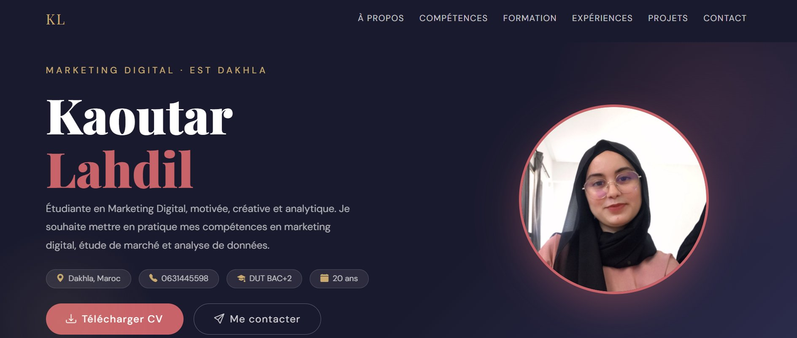
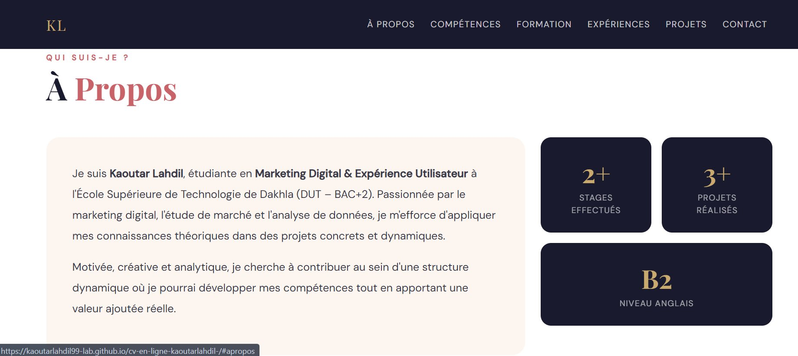
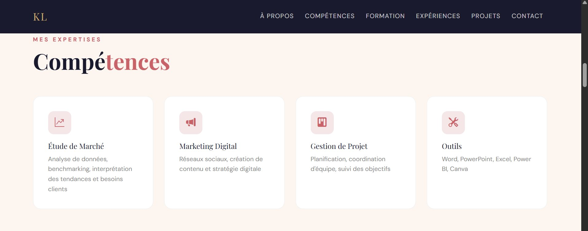
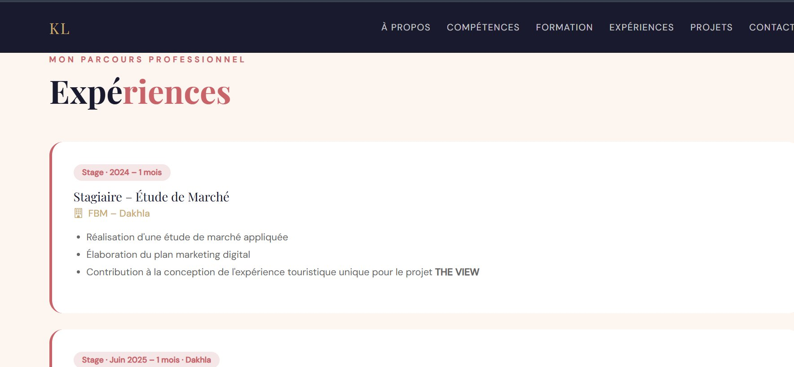
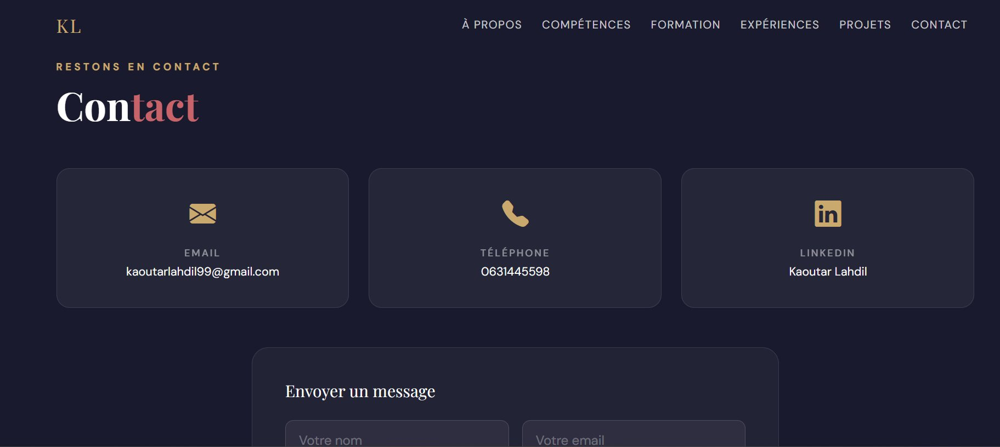

💼 CV en Ligne – Kaoutar Lahdil

> Projet réalisé dans le cadre du TP Optimisation Web  
> Filière : Marketing Digital & Expérience Utilisateur  
> École Supérieure de Technologie – Dakhla | Année : 2025/2026

---

## 📌 Description du projet

Site web CV professionnel, responsive, conçu avec **Bootstrap 5** et publié gratuitement via **GitHub Pages**.  
Le site présente mon parcours académique, mes compétences, mes expériences professionnelles et mes projets.

---

## 🛠️ Technologies utilisées

| Technologie | Usage |
|-------------|-------|
| HTML5 | Structure du site |
| CSS3 | Styles personnalisés |
| Bootstrap 5 | Grille responsive, composants |
| Bootstrap Icons | Icônes |
| Google Fonts | Typographie (Playfair Display, DM Sans) |
| GitHub Pages | Hébergement gratuit |

---

## 📁 Structure du projet

```
cv-en-ligne-kaoutarlahdil/
├── index.html        → Page principale du CV
├── README.md         → Documentation du projet
└── assets/
    └── css/
        └── style.css → Feuille de style personnalisée
```

---

## ✅ Composants Bootstrap utilisés

- **Navbar** avec ancres vers chaque section
- **Grid system** (col-md-*, col-lg-*)
- **Cards** pour les compétences et projets
- **Buttons** (btn, btn-outline)
- **Formulaire de contact**
- **Container / Row / Col** pour le layout responsive

---

## 📱 Adaptation Responsive

- Utilisation de `col-md-*` et `col-lg-*` pour adapter les colonnes
- Navbar collapse sur mobile avec bouton hamburger
- Images et textes adaptés via breakpoints Bootstrap
- Testé sur mobile, tablette et desktop

---

## 📸 Captures d'écran

### Section Profil / Hero


### Section À Propos


### Section Compétences


### Section Expériences


### Section Contact


---

## 🔗 Liens officiels

- 🌐 **Site en ligne** : [https://kaoutarlahdil99-lab.github.io/cv-en-ligne-kaoutarlahdil-/](https://kaoutarlahdil99-lab.github.io/cv-en-ligne-kaoutarlahdil-/)
- 💻 **Dépôt GitHub** : [https://github.com/kaoutarlahdil99-lab/cv-en-ligne-kaoutarlahdil-](https://github.com/kaoutarlahdil99-lab/cv-en-ligne-kaoutarlahdil-)
- 👔 **LinkedIn** : [https://linkedin.com/in/kaoutar-lahdil-079bbb390](https://linkedin.com/in/kaoutar-lahdil-079bbb390)

---

## 👩‍💻 Auteure

**Kaoutar Lahdil**  
📧 kaoutarlahdil99@gmail.com  
📍 Dakhla, Maroc
